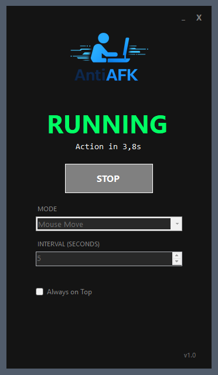

# AntiAFK

  

A lightweight Windows desktop application that prevents your computer from going idle by performing periodic actions.

Designed to be simple, fast, and dependency-free.

---

## Features

- Start/Stop anti-idle actions
- Multiple activity modes
- Adjustable interval in seconds
- Always-on-top option
- Minimal, dark-themed interface
- Lightweight and fast

---

## Modes

- **Mouse Move**  
  Performs small mouse movements at set intervals.

- **Keyboard Press**  
  Simulates a key press at the defined interval to prevent idle status.

---

## How It Works

The application performs a small action at a fixed interval to prevent the system from being marked as idle.

You can:

1. Choose a mode
2. Set the interval (in seconds)
3. Click **Start**
4. The app will run in the background

---

## Usage

1. Launch the application.
2. Select the desired **mode**.
3. Set the **interval**.
4. Click **Start**.

Click **Stop** at any time to disable the anti-idle behavior.

---

## System Requirements

- Windows 10 or newer
- .NET runtime (if not published as self-contained)

---

## Screenshot

  

---

## Version

**v1.0**

---

## License

This project is licensed under the **MIT License**.
